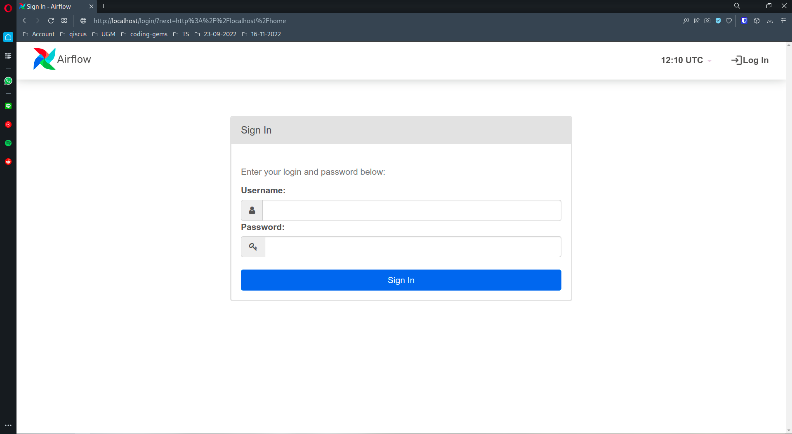
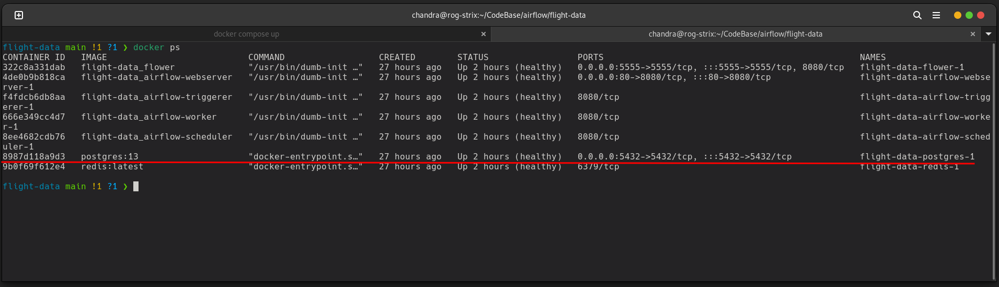
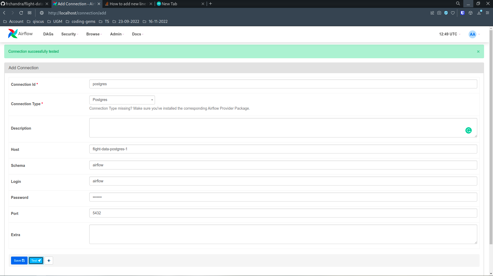
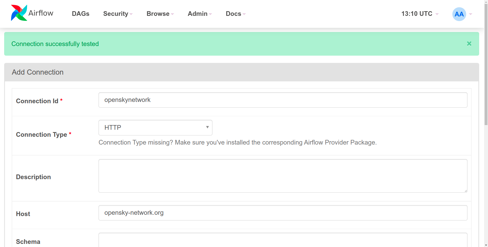
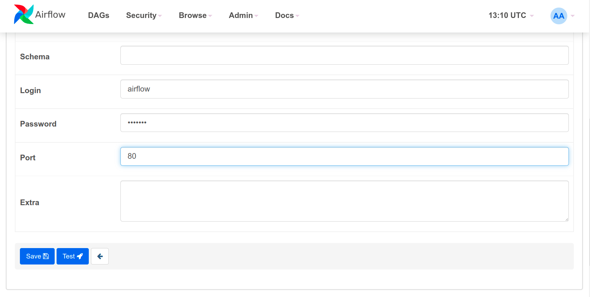

# Airflight Data ETL Project
[](https://www.python.org/)
[](https://airflow.apache.org/)
[](https://docker.com)
[](https://lbesson.mit-license.org/)

## Anggota Kelompok
1. Nismara Chandra Herdiputra 20/456374/TK/50504
2. Aditya Ramadhan 20/460535/TK/51124
3. Fiorenza Celestyn 20/460545/TK/51134
4. Agnes Suarna  20/463589/TK/51581
5. Ananta Pridya Yudha 20/463592/tk/51584


## Cara Menjalankan Aplikasi
0. Karena aplikasi ini sangat bergantung pada kinerja docker yang stabil, maka **disarankan untuk menjalankan kode ini menggunakan OS dan environment Linux**. Alterfatif bagi pengguna OS selain linux adalah menjalankan docker desktop atau virtualisasi linux. Penjelasan cara menginstall docker tidak dijelaskan disini

1. Clone/fork repositoty ini lalu pindahkan working directory anda ke repository ini
2. Karena repository ini menggunakan image apache airflow yang telah dimodifikasi (anda dapat melihat modifikasi yang diterpakan di dalam [Dockerfile](./Dockerfile)), maka anda berlu membuat imagenya terlebih dahulu menggunakan docker command ini. (**mungkin memakan durasi yang lama**)
3. Secara default kami mengatur port aplikasi ini berjalan di 80 untuk webserver dan 5432 untuk database. Namun anda dapat mengkustomisasinya dengan cara mengedit entry 'ports' di file [docker-compose](./docker-compose.yaml)-nya. Anda hanya dapat mengedit port milik 'host' (yang sisi kiri)
```
docker compose build
```
4. Pastikan tidak ada error pada saat proses ```build``` Lalu jalankan container aplikasi ini dengan docker command
```
docker compose up
````
*  gunakan command ini bila ingin menjalankan dengan mode running in the background 
```
docker compose up -d
```
5. Akseslah url ```http://localhost``` dengan port yang anda konfigurasi (secara default 80 ```http://localhost:80```). Bila anda semua terkonfigurasi dengan  benar dan berjalan dengan baik, maka seharusnya anda melihat tampilan login seperti ini

***username dan password defaultnya adalah airflow/airflow***

6. Setelah anda berhasil login, anda dapat melihat halaman ini 

7. Selanjutnya anda perlu mengkoneksikan aplikasi ini dengan layanan yang dibutuhkan (database dan RESTapi). Untuk ini anda perlu mengakses meenu admin->connections

8. **Menghubungkan airflow dengan database**. Untuk menghubungkan dengan database anda perlu melihat nama container database yang berjalan dengan mengetikan perintah ini di terminal ``` docker ps```. Sebagai contoh, nama container database milik kami adalah **flight-data-postres-1**. Nama container ini akan digunakan sebagai alamat database host. 
 Tekan tombol 'plus' lalu lengkapi kolom konfigurasi seperti ini. Jika anda tidak memodifikasi konfigurasi apapun dan mengikuti langkah default, maka seharunnya anda hanya perlu mengikuti tangkap layar kami berikut ini (schema, user dan password default adalah 'airflow') Anda dapat mencoba mengklik tombol test, jika konfiguasi benar maka akan muncul notifikasi positif. Setelah berhasil klik tombol 'save'

 9. **Menghubungkan airflow dengan RestAPI service**
 Kembali ke halaman add connection, tekan kembali tombol 'plus' lalu isi kolom konfigurasi sesuai dengan tangkap layar berikut ini. 

 10. Konfigurasi selesai. Selanjutnya anda dapat kembali ke halaman 'home' dan sudah bisa menjalankan 'dag_etl_aircraft' atau 'dag_flight_data'


## Link Video Presentasi

## Link File Presentasi

